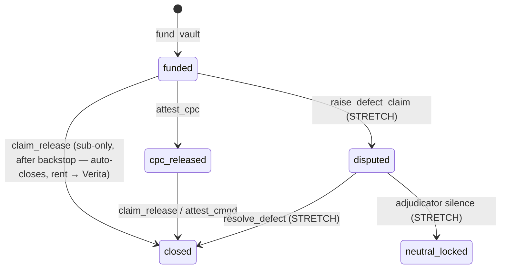

# Implementation Plan — Tahan (verita-retention) Product Demo

## Problem Statement
Build a demonstrable product for the Colosseum judged submission showing the Tahan retention vault end-to-end: a Solana devnet Anchor program (backend) plus a Next.js frontend. The demo must land the money-shot — a main contractor cannot claw back deposited retention, and a subcontractor can release the undisputed retention unilaterally after the time-backstop with no counterparty signature. Time is fast-forwarded on-stage via a demo-only admin instruction. Scope is phased: core custody + backstop first (demo-ready), defect/adjudication path added if time allows.

## Requirements
- Judged hackathon submission, scoped to the demo deliverable.
- On-chain core slice: `fund_vault`, `claim_release` (sub-only, backstop-gated), certificate-gated release path, provable contractor-withdrawal refusal.
- Demo-only admin instruction to advance the effective timestamp, feature-gated so it never ships in production.
- Native SOL held by the vault PDA; UI shows SOL with a MYR-equivalent label; `mint` field kept swappable but unused.
- Frontend: `@solana/wallet-adapter` + Anchor TS client, Phantom on devnet, public devnet RPC.
- Team: 2 AI-assisted builders, 1 frontend, 1 backend.
- Phased: core slice to demo-ready milestone, then defect/adjudication as stretch.
- Business model note: Verita fronts the per-vault Solana account rent (a negligible fraction of a SOL per vault, scaling linearly with active vaults) as `rent_payer` and recovers it on close — consistent with the platform fee model; it is Verita's own float, not the contractor's or sub's.

## Background
- Greenfield: no code exists in `verita-retention/`, only research/planning docs.
- BUILD-PLAN §4 defines `retention_vault` PDA per (project, subcontractor), `released_cumulative` running total, certificate attestation, three-clock backstop, state machine `{ funded, cpc_released, disputed, neutral_locked, closed }`.
- Design invariants to honor from the start: `released_cumulative` not a boolean; every remainder rounds to the subcontractor (no dust stranded); `close_vault` asserts zero residual; explicit signer/authority constraints on every instruction.
- Native SOL in a program-owned PDA makes the custody/insolvency-remoteness claim structurally real and demonstrable live.
- Money-shot (§7): fund a vault, attempt early withdrawal and watch it fail, roll time to DLP expiry, sub claims unilaterally.

## Design overview
Custody: SOL transferred into the `retention_vault` PDA at funding; only the program can sign for the PDA, so contractor withdrawal is structurally impossible. Funding is split-payer: the contractor sends the retention `amount`, while Verita funds the account rent as a separate `rent_payer`. Releases are `invoke_signed` lamport transfers guarded by signer/authority/timing invariants; a fully-draining sub-only `claim_release` auto-closes the account and refunds rent to Verita, so no counterparty signature is ever needed to close. Demo clock: a `clock_offset` on the vault, settable only by a `demo_authority` via a feature-gated `advance_clock`. In production `effective_ts` reads `Clock::unix_timestamp` directly; the `clock_offset` and the `effective_ts = Clock::unix_timestamp + clock_offset` indirection exist **only in the demo build** (`#[cfg(feature="demo")]`) and are compiled out otherwise. Frontend: role-framed views (Contractor, Subcontractor, Demo Control) driven by one connected wallet at a time; MYR-equivalent is a static UI multiplier.

*The sub-only backstop `claim_release` fully drains and auto-closes the account in one instruction, refunding rent to Verita (`rent_payer`) — no contractor or sub signature needed to close.*

**Tooling note:** exact Anchor / Solana CLI / Next.js / wallet-adapter versions pinned in BE-1 against what's current at build time.

**API contract (frontend ↔ backend).** Since the tracks build separately, the on-chain interface is specified up front in `API-CONTRACT-retention.md` (program ID, PDA seeds, account layouts, instruction signatures, error codes, MYR display convention) with a companion stub `tahan.idl.json` the frontend imports into the Anchor TS client on day one. Core-slice shapes are frozen for FE-1→FE-3; the real IDL from BE-1 replaces the stub and is reconciled against the contract in the same PR.

## Risks & mitigations

Ordered by severity. Each is a **risk → mitigation**; the on-stage-breaking ones are called out HIGH.

1. **Devnet airdrop is unreliable (HIGH — most likely to break the demo).** Airdrop is capped at **2 SOL/request**, rate-limited to ~2–5 req/min and throttled per-IP — conference wifi is one shared NAT'd IP, and the web faucet now requires GitHub sign-in. → **Pre-fund all four keypairs** (deploy, contractor, sub, demo-authority) **the night before over stable hotel/home wifi**, using several spaced 2-SOL airdrops or a console faucet (Chainstack/QuickNode); keep a **funded backup keypair set**; and **record a full clean run of the demo as the ultimate fallback.**
2. **Public RPC is a single point of failure on conference wifi (HIGH).** Shared/public endpoint p99 latency spikes to ~800–1850ms vs ~25–60ms on a dedicated endpoint under congestion, and conference networks are hostile. → Pin a **Helius (or QuickNode) devnet API-key endpoint as primary, `api.devnet.solana.com` as fallback**, configured in FE-1; grab the free key the night before.
3. **`close_vault` rent-refund + closing authority after a sub-only claim (MEDIUM — DECIDED).** If closing the drained vault needed the contractor's signature or refunded rent to the contractor, the "no counterparty permission" claim would earn an asterisk. → **Resolved:** Verita funds the account rent as a separate `rent_payer` at `fund_vault` (BE-2); a fully-draining sub `claim_release` **auto-closes the account in the same instruction** (BE-4), refunding the rent to `rent_payer` (Verita). **No contractor or sub signature is ever needed to close** — the only party at the end is the neutral platform reclaiming its own float, so closing now *demonstrates* the platform's role rather than undercutting the permissionless claim.
4. **Demo-clock offset ambiguity in the production build (MEDIUM, judge-facing).** The `clock_offset` field (BE-2) + the `effective_ts` indirection (BE-3) may survive into the production build while only the *setter* is feature-gated, letting a judge ask "so production still trusts a stored offset?" → Either **compile the field + indirection out entirely under `#[cfg(not(feature="demo"))]`** so production reads `Clock` directly, or state plainly the offset is demo-only dead weight. Resolved in BE-5.
5. **MYR-equivalent can read as a real FX oracle (LOW).** A static "MYR-equivalent" label may make a judge think there's an FX oracle behind it. → FE-2 must label it **"illustrative rate, demo only."**
6. **Security write-up stranded in STRETCH (HIGH — scored).** BUILD-PLAN §5/§9 make the security pass *explicitly scored* and the unfair advantage — it must not sit in the first-cut tier. → Pull the **written security pass out of BE-8 into a non-stretch deliverable (SEC-1)** covering whatever shipped (custody refusal, no early release, dust rounding, signer/authority constraints, demo-gating); only the `neutral_locked` *code* stays stretch.
7. **Live wallet-switching is clunky (MEDIUM).** Phantom account-switching mid-demo is slow and error-prone. → Use **two browser profiles / side-by-side wallets** for contractor vs sub, and script the switch explicitly in INT-1.
8. **Backstop-from-`funded` path can read as skipped certification (LOW, judge-facing).** The backstop `claim_release` from `funded` legitimately skips the certificate path (per §4), but a judge may think certification was skipped by accident. → INT-1 script must **say aloud "this is the time-backstop path, not the normal certificate path."**
9. **PDA reseed between rehearsals (MEDIUM).** PDAs are deterministic per (project, sub, contractor) seeds, so a re-run with the same seeds hits an already-initialized account and the second rehearsal fails. → The FE-3 reset helper must **close the old vault or vary a project/nonce seed per run.**

## Task Breakdown

*Sequencing: BE-1 → BE-2 → BE-3 → BE-4 → BE-5 → BE-6 unlock the demo-ready backend milestone. FE-1 depends on BE-1 (program deployed) and the IDL. FE-2 depends on BE-2/BE-4. FE-3 depends on BE-5. The full rehearsal (INT-1) depends on FE-3 + BE-6. Stretch: BE-7, BE-8, FE-4.*

### Backend track (Anchor / Rust — devnet)

- [ ] **BE-1: Scaffold Anchor workspace + devnet toolchain**
  Objective: create `programs/tahan`, pin Anchor + Solana CLI versions, configure `Anchor.toml` for devnet, fund a deploy keypair via airdrop, add a trivial instruction to compile/deploy.
  Test: `anchor build` and `anchor deploy` to devnet succeed; a test connects to the program ID.
  Demo: empty program deployed and verifiable on Solana Explorer (devnet).

- [ ] **BE-2: `retention_vault` account + `fund_vault` with real PDA custody**
  Objective: define the PDA (seeds: `sha256(project_id)` + subcontractor + contractor — `project_id` is hashed to a fixed 32 bytes so any-length name fits the seed limit and both tracks derive it identically; the raw string is also stored on the account for display, see `API-CONTRACT-retention.md` §1) storing parties, `mint` (unused/swappable), `amount`, `practical_completion_ts`, `dlp_days`, `grace_days`, `released_cumulative`, `status`, `demo_authority`, `rent_payer` (= Verita/platform), `clock_offset` *(demo-build field — compiled out in production per BE-5)*. Implement `fund_vault` with a split-payer design: the **contractor signs + sends the retention `amount`**, while **Verita signs as a separate `rent_payer` and funds the account rent** (Solana allows a distinct rent payer from the funds sender); store `rent_payer = Verita`. `status = funded`, `released_cumulative = 0`.
  Test: fields correct; PDA balance increases by `amount`; contractor and `rent_payer` (Verita) both signed; `rent_payer` stored; double-fund rejected.
  Demo: contractor funds a vault (Verita fronts the rent); PDA holds SOL on Explorer.

- [ ] **BE-3: Prove the refusal — no contractor withdrawal path**
  Objective: add the `effective_ts` helper and invariant tests proving no instruction lets the contractor pull funds after funding; add explicit signer/authority constraints on every instruction.
  Test: any contractor-signed withdrawal attempt fails; PDA balance unchanged by contractor calls.
  Demo: contractor tries to reclaim retention, program refuses (money-shot beat 1).

- [ ] **BE-4: `claim_release` — sub-only, backstop-gated, rounds to sub**
  Objective: sub-only release of `amount − released_cumulative` once `effective_ts ≥ practical_completion_ts + dlp_days + grace_days`; `invoke_signed` transfer from PDA to sub; update `released_cumulative`; round remainder to sub; move status toward `closed`. No contractor signature. When the claim **fully drains** the vault, **auto-close the account in the same instruction**, refunding the account rent to the stored `rent_payer` (Verita) — no contractor and no sub signature is ever required to close, keeping the sub's claim a self-contained action.
  Test: early claim rejected; on-time claim succeeds with only sub signature; balances/`released_cumulative` correct; zero residual after full release; on full drain the account is closed and rent is refunded to `rent_payer` (Verita), with no contractor/sub close signature.
  Demo: after clock advance, sub claims unilaterally and the vault auto-closes — Verita reaps its own rent (beat 2).

- [ ] **BE-5: `advance_clock` demo control (feature-gated)**
  Objective: demo-only `advance_clock`/`set_demo_now` setting `clock_offset`, callable only by `demo_authority`, behind a `demo` feature flag (excluded from production build). Authority distinct from contractor/sub. Resolve the clock-offset ambiguity (risk #4): in the production build, **`effective_ts` reads `Clock` directly and the `clock_offset` field + `effective_ts` indirection are compiled out under `#[cfg(not(feature="demo"))]`** — production never trusts a stored offset.
  Test: `demo_authority` advances clock; contractor/sub cannot; with feature off the instruction is absent; advancing flips `claim_release` from rejected to allowed.
  Demo: operator rolls time to DLP expiry live, then BE-4 claim succeeds.

- [ ] **BE-6: Certificate-gated release path (`attest_cpc` / `close_vault`)**
  Objective: `attest_cpc` (certifier/CA authority) releases the first moiety per `release_schedule` (partial via `released_cumulative`); `close_vault` asserts zero residual, closes account, refunds rent to the stored **`rent_payer` (Verita), not the contractor**. After a full backstop drain the account is already auto-closed by BE-4; `close_vault` remains for the certificate-path completion (final moiety released via attestation, then explicit close).
  Test: attestation releases exactly the scheduled moiety; remainder handled by a second claim/attest; `close_vault` fails if residual ≠ 0; rent refund lands with `rent_payer` (Verita).
  Demo: normal certificate path releases the first half, distinct from backstop — shows the hybrid design.

- [ ] **SEC-1: Written security pass (NON-STRETCH — explicitly scored)**
  Objective: write the security pass covering **whatever actually shipped** — no contractor withdrawal after funding, no early release, no dust stranding (every remainder rounds to the sub), signer/authority constraints on every instruction, and demo-clock feature-gating. Each claim maps to a passing invariant test. Per BUILD-PLAN §5/§9 this is scored and is the unfair advantage — it is **never cut** even if the defect/adjudication code is dropped.
  Test: each security-doc claim maps to a passing test against the shipped instruction set.
  Demo: honest trust-floor slide backed by passing invariant tests.

- [ ] **BE-7 (STRETCH): Defect/adjudication — `raise_defect_claim` + `resolve_defect`**
  Objective: capped, bonded freezes (contractor-only, before DLP-close cutoff, per-freeze + aggregate caps, stakes a bond); `resolve_defect` (named adjudicator splits frozen slice; invalid freeze → sub + bond slashed); `claim_release` releases only `amount − released_cumulative − aggregate_frozen`.
  Test: freeze rejected after cutoff or above aggregate cap; a genuine capped defect stays locked even after the sub hits the backstop; resolve both ways; bond slashing correct.
  Demo: beat 3 — a real capped defect stays locked to adjudication despite the timer.

- [ ] **BE-8 (STRETCH): `neutral_locked` state**
  Objective: `neutral_locked` refusing auto-resolution on adjudicator silence (no timer resolves to either party). *(The written security pass is now SEC-1, a non-stretch deliverable — only this `neutral_locked` code is stretch.)*
  Test: silence path lands in `neutral_locked`, undrainable by either party alone.
  Demo: the trust-floor state — money frozen neutral when the adjudicator goes dark, never auto-released.

### Frontend track (Next.js / wallet-adapter — devnet)

- [ ] **FE-1: Next.js scaffold + wallet-adapter + typed client** *(depends on BE-1 IDL)*
  Objective: create the Next.js app, install `@solana/wallet-adapter` (Phantom, devnet, public RPC), wire the Anchor-generated IDL/types into a shared typed client module, confirm wallet connect + read the deployed program.
  Test: connect Phantom on devnet; read a vault account's fields into the UI; frontend lint/build passes.
  Demo: connect wallet, see live vault on-chain state rendered (the "verify it yourself" value prop).

- [ ] **FE-2: Contractor + Subcontractor views** *(depends on BE-2, BE-4)*
  Objective: Contractor view (create + `fund_vault`, plus a "try to withdraw" button surfacing the program's refusal); Subcontractor view (live balance + backstop countdown + `claim_release`). Amounts as SOL with MYR-equivalent label; render tx signatures with Explorer links.
  Test: end-to-end from UI on devnet — fund from contractor wallet, attempt withdraw (fails, shown), switch to sub wallet, claim.
  Demo: money-shot beats 1 and 2 as a clickable flow.

- [ ] **FE-3: Demo Control panel** *(depends on BE-5)*
  Objective: operator Demo Control view exposing `advance_clock`; add a reset/redeploy helper so the demo re-runs cleanly.
  Test: operator advances the clock from the UI and the sub claim flips from blocked to allowed.
  Demo: on-stage clock roll to DLP expiry wired into the claim flow.

- [ ] **FE-4 (STRETCH): Defect/adjudication UI** *(depends on BE-7, BE-8)*
  Objective: contractor freeze filing (`raise_defect_claim`) with cap/cutoff feedback, adjudicator resolve view, and a `neutral_locked` status display; show that a claimed release excludes the frozen slice.
  Test: UI reflects a locked slice remaining after a backstop claim; resolve updates balances correctly.
  Demo: beat 3 through the UI.

### Integration

- [ ] **INT-1: Full end-to-end rehearsal (demo-ready milestone)** *(depends on FE-3 + BE-6)*
  Objective: script and rehearse the on-stage flow: fund → verify custody → withdraw refused → roll clock to DLP expiry → sub claims unilaterally → vault closed with zero residual. Confirm the loop runs against devnet with a wallet not owned by the presenter (outside-tester gate).
  Test: a scripted integration test runs the full sequence; an outside tester completes fund→expiry→release unaided.
  Demo: the complete money-shot, live on devnet.

## Cut-line (BUILD-PLAN §8)
If behind, drop BE-7/BE-8/FE-4 first (state defect path as designed-not-built), then BE-6's certificate path. Never cut: `claim_release` backstop with no counterparty signature (BE-4), real PDA custody (BE-2/BE-3), the full rehearsal (INT-1), and the **written security pass (SEC-1)** — it is explicitly scored (BUILD-PLAN §5/§9) and covers whatever shipped, so it is never dropped even when BE-8's `neutral_locked` code is.
