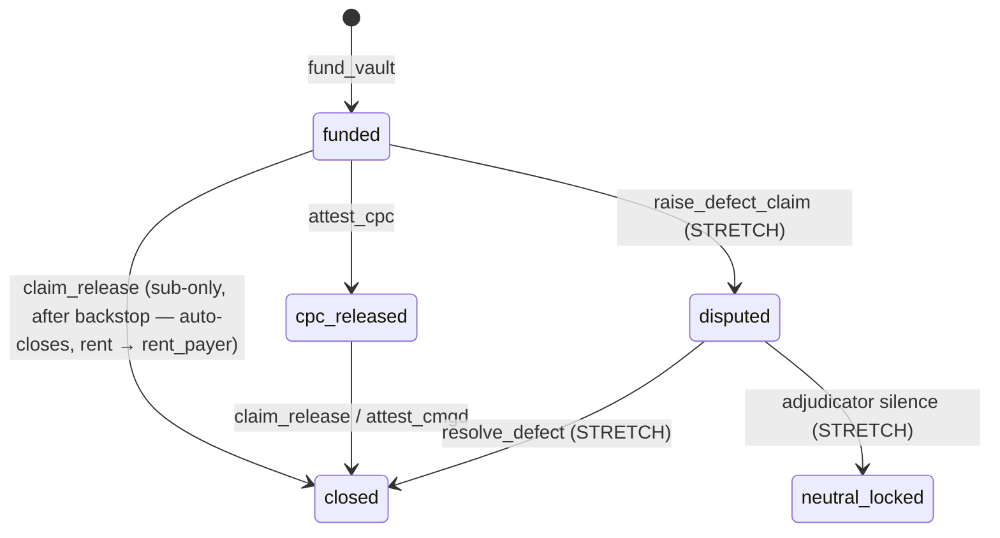

# Technical Specification: Verita (Tahan Vault System)

**Project Name:** Verita (`verita-retention`)

**Program Name:** Tahan

**Version:** 2.0 (Master Specification)

**Date:** 08/09/2026

**Author:** dkgn

---

## 1. Master Document Directory

This specification serves as the primary system entry point. Technical details, contract schemas, and task execution are specified in the following companion documents:

| Document | Purpose & Scope |
| :--- | :--- |
| **[`API-CONTRACT-retention.md`](./API-CONTRACT-retention.md)** | **On-Chain API Interface & Schema:** Defines PDA seed derivations, account layouts (`RetentionVault`, `Freeze`), instruction account maps/args, Anchor error codes, and frontend read patterns. |
| **[`DEMO-PLAN-retention.md`](./DEMO-PLAN-retention.md)** | **Implementation Plan & Hackathon Roadmap:** Task breakdown (BE-1–BE-8, FE-1–FE-4, SEC-1), rehearsal scripts, live rehearsal risk mitigations, and cut-line rules. |
| **[`tahan.idl.json`](./tahan.idl.json)** | **Anchor Stub IDL:** Typescript/client stub defining instruction endpoints and structs for the `@coral-xyz/anchor` frontend client. |

---

## 2. Overview & Core Invariants

Verita is an on-chain retention vault system built on Solana (Devnet) designed to protect subcontractors by programmatically isolating retention funds (typically 5%) during construction projects.

### Fundamental Invariants
1. **Programmatic Isolation:** Funds are held by a non-custodial Program Derived Address (PDA). The main contractor cannot withdraw deposited funds under any circumstances.
2. **Unilateral Backstop Release:** Upon reaching the time backstop (`practical_completion_ts + dlp_days + grace_days`), the subcontractor can claim funds unilaterally without counterparty or contractor signatures.
3. **Split-Payer Rent Allocation:** Retention deposit (`amount`) is paid by the Main Contractor; account rent is paid by Verita (`rent_payer`). Draining claims auto-close the vault account and return rent to `rent_payer`.
4. **Feature-Gated Demo Clock:** Time advancement (`advance_clock`) modifies `clock_offset` solely in builds compiled with `#[cfg(feature="demo")]`. Production builds read `Clock::unix_timestamp` directly.

---

## 3. High-Level Architecture & State Machine

### Vault Statuses
* `funded` (0): Deposited, custody active.
* `cpc_released` (1): First moiety released via Certificate of Practical Completion.
* `disputed` (2): Active defect freeze filed before DLP cutoff (STRETCH).
* `neutral_locked` (3): Adjudicator deadline expired without response; locked pending manual intervention (STRETCH).
* `closed` (4): Zero residual, rent returned to `rent_payer`.

---

## 4. System Components & Technical Stack

### 4.1 On-Chain Program (Anchor / Rust)
* **Cluster:** Solana Devnet.
* **Asset:** Native SOL held in vault PDA lamports.
* **PDA Derivations:** 
  * `retention_vault`: `["vault", sha256(project_id), subcontractor, main_contractor]`.
  * `freeze`: `["freeze", vault_pubkey, freeze_id]` (STRETCH).
* **Full Instructions Specification:** See [`API-CONTRACT-retention.md` §3](./API-CONTRACT-retention.md).

### 4.2 Frontend Application (Next.js / TypeScript)
* **Framework:** Next.js (App Router), React, Tailwind CSS, MUI.
* **Web3 Integrations:** `@solana/web3.js`, `@coral-xyz/anchor`, `@solana/wallet-adapter` (Phantom).
* **Currency Formatting:** Displayed in SOL with illustrative MYR conversion rates (`MYR_PER_SOL` frontend constant).
* **Views & Demo Control:** Role-framed dashboards for Main Contractor, Subcontractor, Certifier, and an Operator Demo Control panel for fast-forwarding timestamps.

---

## 5. Summary of Instructions & Execution Rules

| Instruction | Caller / Signers | Timing / Condition | Effect |
| :--- | :--- | :--- | :--- |
| **`fund_vault`** | `main_contractor` [s], `rent_payer` [s] | Uninitialized PDA | Creates vault PDA, deposits SOL, stores parameters. |
| **`claim_release`** | `subcontractor` [s] | `effective_ts >= backstop_ts` | Releases remaining undisputed lamports; auto-closes if fully drained. |
| **`attest_cpc`** | `certifier` [s] | Certificate issued, `!cpc_attested` | Releases scheduled first moiety (`release_schedule_bps`). |
| **`close_vault`** | Any caller | Vault balance = rent only | Closes account, refunds rent to `rent_payer`. |
| **`advance_clock`** | `demo_authority` [s] | Feature flag `demo` enabled | Advances `clock_offset` for live stage testing. |
| **`raise_defect_claim`** | `main_contractor` [s] (STRETCH) | `effective_ts < dlp_close_ts` | Staking bond; freezes slice up to aggregate cap. |
| **`resolve_defect`** | `adjudicator` [s] (STRETCH) | Active freeze | Splits frozen funds; slashes bad-faith bonds to sub. |

---

## 6. Implementation & Roadmap Links

Refer to [`DEMO-PLAN-retention.md`](./DEMO-PLAN-retention.md) for full execution timelines, task dependencies, and rehearsal checklists:
* **Milestone 1 (Core Slice):** Deployment of program, basic funding, time backstop claims, and demo control setup (`BE-1` to `BE-6`, `FE-1` to `FE-3`).
* **Milestone 2 (Security Pass - SEC-1):** Invariant testing proving contractor withdrawal lockout and dust rounding guarantees.
* **Stretch Goal (Defects & Adjudication):** Defect freeze filings, bond slashing, and neutral lock state handling (`BE-7`, `BE-8`, `FE-4`).
